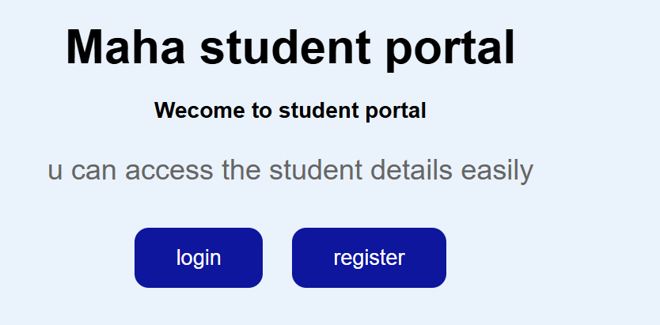
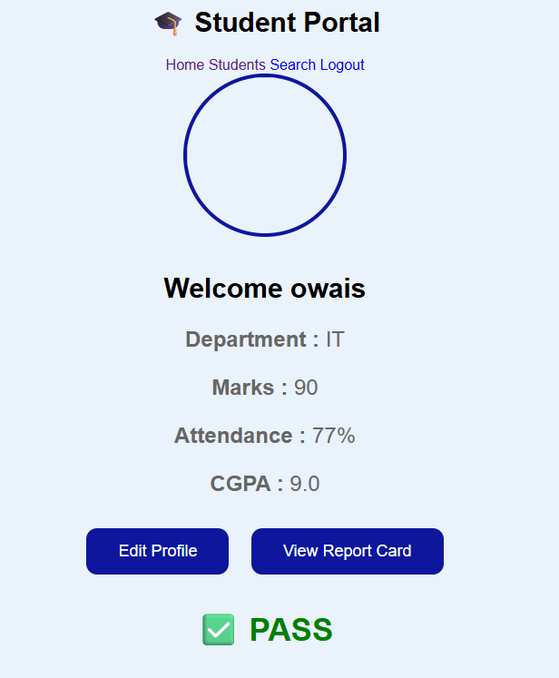
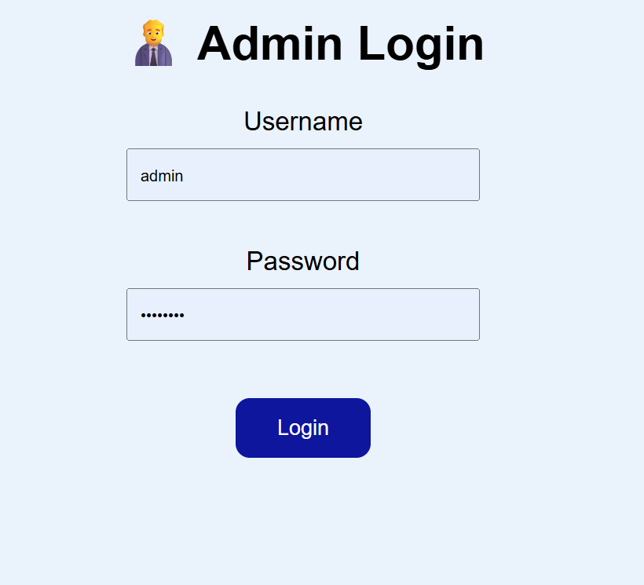
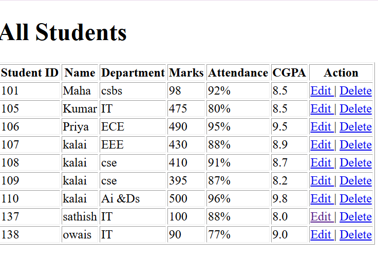
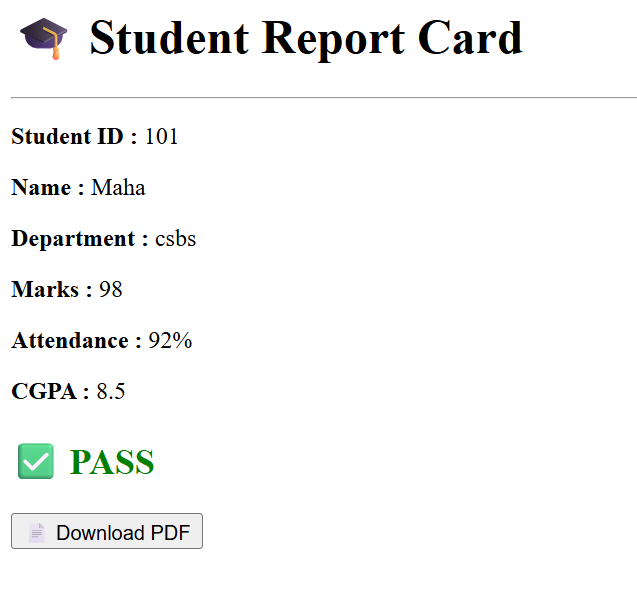

# 🎓 Student Portal

A Student Portal web application developed using **Python Flask**, **SQLite**, **HTML**, and **CSS**. This project allows students to log in, view their academic details, and lets administrators manage student records.

---

## 🚀 Live Demo

🌐 https://student-portal-flask-7bkp.onrender.com

---

## 📸 Screenshots

### 🏠 Home Page


### 👨‍🎓 Student Dashboard


### 👨‍💼 Admin Dashboard


### 👥 Students List


### 📄 Report Card



## ✨ Features

### Student
- Student Login
- Student Registration
- View Dashboard
- Edit Profile
- View Marks
- View Attendance
- View CGPA
- View Report Card
- Logout

### Admin
- Admin Login
- Add Student
- View All Students
- Edit Student Details
- Delete Student
- Search Student
- Rank Students by CGPA

---

## 🛠 Technologies Used

- Python
- Flask
- SQLite
- HTML5
- CSS3
- Git
- GitHub
- Render (Deployment)

---

## 📂 Project Structure

```
Student Portal/
│
├── app.py
├── student.db
├── requirements.txt
├── Procfile
│
├── static/
│   ├── style.css
│   └── images/
│
├── templates/
│   ├── home.html
│   ├── login.html
│   ├── register.html
│   ├── dashboard.html
│   ├── admin_login.html
│   ├── admin_dashboard.html
│   ├── students.html
│   ├── search.html
│   ├── rank.html
│   ├── report.html
│   └── ...
│
└── README.md
```

---

## ⚙️ Installation

Clone the repository:

```bash
git clone https://github.com/Maharajan-21/student-portal-flask.git
```

Move into the project folder:

```bash
cd student-portal-flask
```

Install dependencies:

```bash
pip install -r requirements.txt
```

Run the project:

```bash
python app.py
```

Open your browser:

```
http://127.0.0.1:5000
```

---

## 📌 Future Improvements

- Upload Profile Photo
- Forgot Password
- Email Notifications
- Online Fee Payment
- Student Timetable
- Assignment Submission
- PostgreSQL Database
- Mobile Responsive Design

---

## 👨‍💻 Author

**Maha Rajan**

GitHub:
https://github.com/Maharajan-21

---

## ⭐ If you like this project

Please give this repository a ⭐ on GitHub.
